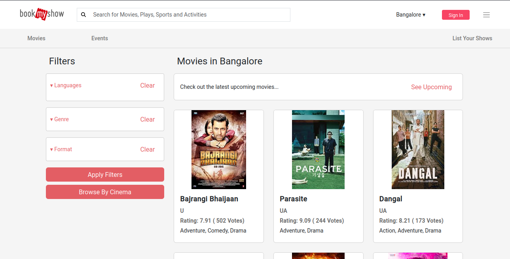
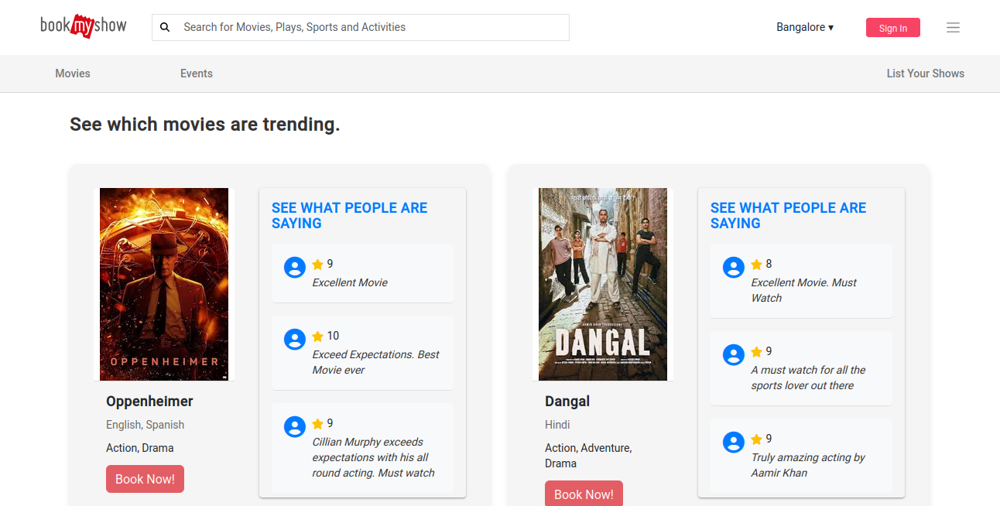
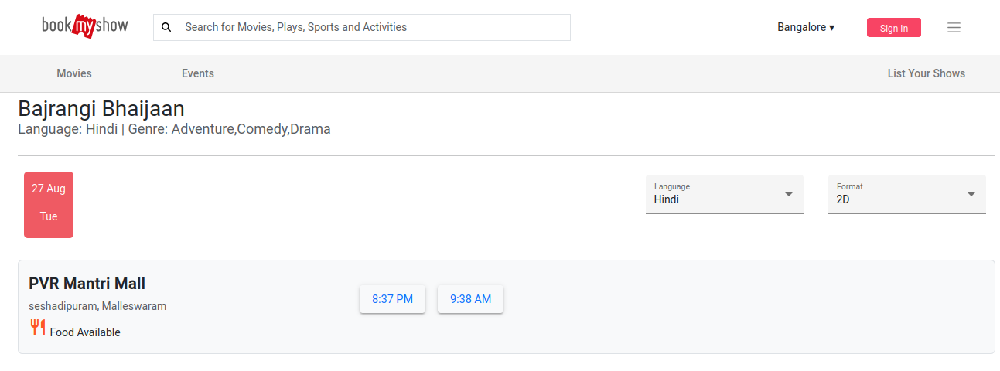
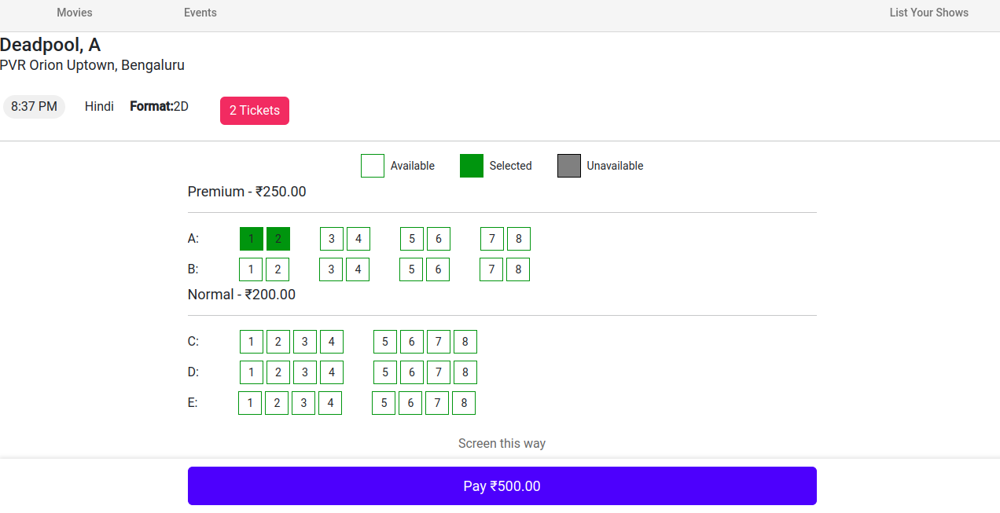

# BookMyShow -CLONE

## Description
BookMyShow is a full-stack web application built using the MEAN stack (MongoDB, Express.js, Angular, Node.js) with the support of Redis for caching. It allows users to book tickets for movies, providing a seamless experience for browsing, selecting, and booking movie tickets. The application also features trending movies based on user bookings and reviews. 







## Features
- Browse and search for movies
- View movie details, including ratings and reviews
- Book tickets for movies
- View trending movies based on bookings and reviews
- User authentication and profile management

## Getting Started

### Prerequisites
- Node.js
- npm (Node Package Manager)
- Redis

### Installation

1. **Clone the repository:**
    ```sh
    git clone https://github.com/yourusername/BookMyShow.git
    cd BookMyShow
    ```

2. **Install dependencies for the server:**
    ```sh
    cd BookMyShow_Server
    npm install
    ```

3. **Install dependencies for the client:**
    ```sh
    cd ../BookMyShow_Client
    npm install
    ```

### Running the Application

1. **Start the Redis server:**
    ```sh
    redis-server
    ```

2. **Start the server:**
    ```sh
    cd ../BookMyShow_Server
    npm start
    ```

3. **Start the client:**
    ```sh
    cd ../BookMyShow_Client
    npm start
    ```

4. **Access the application:**
    Open your web browser and navigate to `http://localhost:4200` (or the port specified in your client configuration).

## Code Optimization
- **Angular**:
  - Used `combineLatest` for combining multiple observables.
  - Utilized `tap` and `switchMap` for efficient data handling.
  - Managed local subscriptions and unsubscribed on `ngOnDestroy` to prevent memory leaks.
  - Added `debounceTime` to avoid rapid API calls.

- **MongoDB**:
  - Implemented indexing to optimize query performance.
  - Debounced the search query to reduce the load on the database.

## Main Features
- **Authentication**: Secure user authentication.
- **User Account & Profile**: View past bookings.
- **Searching**: Search for movies and cinemas.
- **Booking Flow**: 
  - Movie -> Date -> Theatre -> Time Slot -> Particular Seat/Seats
  - Events -> Book Tickets
- **B2B**: List shows, events, cinemas, etc.

## Secondary or Non-functional Requirements
- **Concurrency**: Handled concurrency in seat booking using `Redis`.
- **Security**: Implemented `JWT tokens` with cookies for secure authentication.
- **Performance and Response Time**: Optimized for fast response times.
- **Complex Functionality**:
  - Updated movie ratings and likes using batch jobs with `cron`.
  - Implemented dynamic seat layout for each show.

## Extra Functions
- **Trending Movies**: 
  - Implemented trending movies on the home page using Redis to store data.
  - Set up a 24-hour cron job to update the trending movies data.

## DB Schema


### Key Points:
- **Users**: Stores user information and authentication details.
- **Movies**: Contains movie details including title, genre, and ratings.
- **Bookings**: Manages booking information linking users to their booked seats.
- **Seats**: Represents the seating arrangement for each show, including availability status.

## API Sequence Diagram


### Key Points:
- **User Authentication**: Secure login and token generation using JWT.
- **Movie Search**: Efficient querying of the movie database to return search results.
- **Booking Seats**: Handles seat selection, availability checks, and booking confirmation.
- **Trending Movies**: Fetches and displays trending movies based on user interactions and bookings.

## Future Improvements
- **Caching**: Implement caching on the fetch movies API and other API's to reduce response time.
- **Error Handling**: Improve error handling to account for edge cases and provide better user feedback.
- **Cloud Storage**: Set up cloud services to store images and other static assets.
- **Scalability**: Enhance the application's scalability to handle more users and data.
- **Microservices**: Break down the monolithic application into microservices for better maintainability and scalability.
- **CI/CD**: Implement continuous integration and continuous deployment (CI/CD) pipelines to automate testing and deployment.
- **Monitoring**: Set up monitoring and logging to track application performance and errors in real-time.

## Contributing
Contributions are welcome! Please fork the repository and submit a pull request for any improvements or bug fixes.

